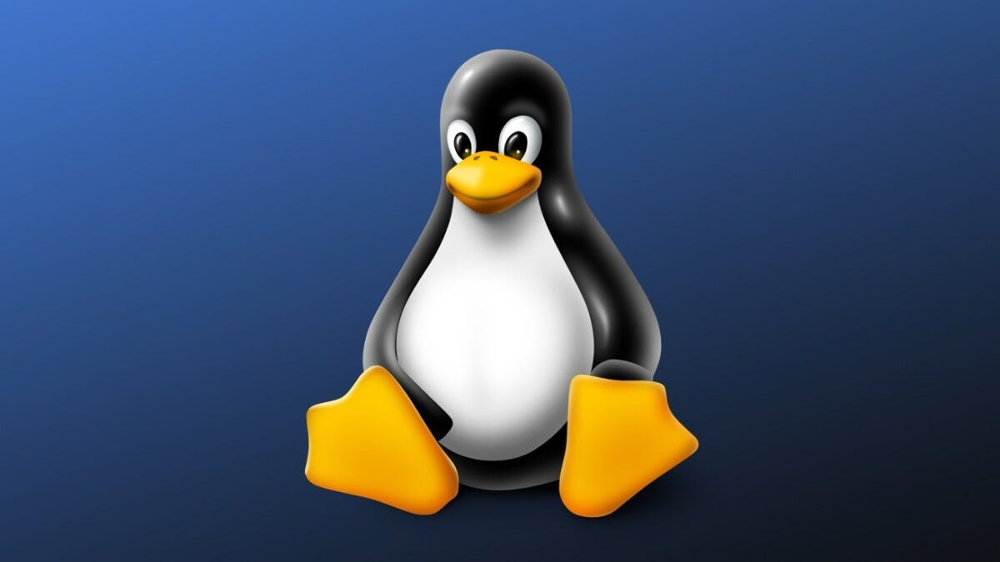
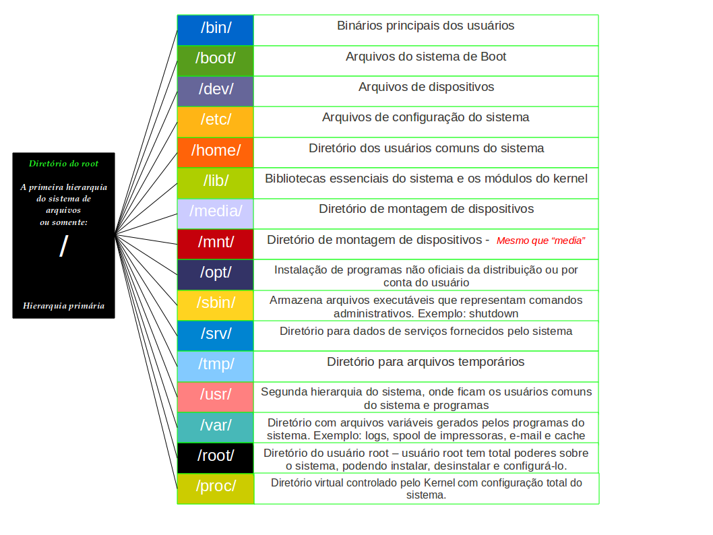

# [](https://git.io/typing-svg)

<div align="center">

</div>

Aqui está uma documentação geral sobre **Linux**, explicando sua origem, principais características, comandos básicos e como utilizá-lo no dia a dia:

---

## **O que é o Linux?**

O **Linux** é um sistema operacional de código aberto baseado no Unix, criado por Linus Torvalds em 1991. Ao contrário de sistemas operacionais como Windows ou macOS, o Linux é gratuito e permite que qualquer pessoa tenha acesso ao seu código-fonte, podendo modificá-lo e distribuí-lo livremente. Ele é amplamente utilizado em servidores, desktops, dispositivos móveis e até mesmo em sistemas embarcados devido à sua flexibilidade, segurança e robustez.

## **Características do Linux**

### 1. **Código Aberto (Open Source)**
O Linux é baseado em código aberto, o que significa que qualquer pessoa pode acessar, modificar e distribuir o código-fonte. Isso promove uma comunidade ativa e colaborativa que contribui para o seu desenvolvimento constante.

### 2. **Multitarefa**
O Linux permite a execução simultânea de vários processos, o que significa que você pode rodar diversos programas ao mesmo tempo de forma eficiente.

### 3. **Multiusuário**
O sistema operacional Linux suporta múltiplos usuários, permitindo que várias pessoas usem o sistema ao mesmo tempo, com controle de permissões e recursos para cada um.

### 4. **Segurança**
O Linux é conhecido pela sua segurança robusta. Ele usa permissões de acesso baseadas em arquivos e executa processos com privilégios limitados, o que dificulta a propagação de falhas de segurança.

### 5. **Estabilidade**
O Linux é muito estável e pode funcionar por longos períodos sem a necessidade de reinicializações. É uma das razões pelas quais é amplamente utilizado em servidores.

### 6. **Suporte a Software Livre**
O Linux possui um vasto ecossistema de software livre, com várias alternativas gratuitas para programas pagos populares, como editores de texto, navegadores, ferramentas de design, etc.

### 7. **Portabilidade**
O Linux pode ser executado em uma variedade de plataformas de hardware, desde computadores pessoais até mainframes e dispositivos embarcados.

---

## **Distribuições Linux**

Existem várias **distribuições** (ou *distros*) do Linux, que são versões personalizadas do sistema com diferentes pacotes de software. As distribuições mais populares incluem:

- **Ubuntu**: Famosa pela sua facilidade de uso, ideal para iniciantes.
- **Debian**: Conhecida pela sua estabilidade e base para muitas outras distribuições.
- **Fedora**: Focada em trazer as últimas inovações do software livre.
- **CentOS / Rocky Linux**: Baseadas no Red Hat Enterprise Linux (RHEL), ideais para servidores.
- **Arch Linux**: Uma distribuição minimalista que permite que o usuário construa seu sistema do zero.
- **Linux Mint**: Baseada no Ubuntu, é uma distribuição voltada para a simplicidade e acessibilidade.

---

## **Hierarquia**

A hierarquia de arquivos do Linux segue uma estrutura de diretórios padronizada e organizada, que facilita a localização e o gerenciamento de arquivos e programas. Essa organização é conhecida como Filesystem Hierarchy Standard (FHS), e nela os arquivos e diretórios são dispostos de forma hierárquica, começando pela raiz, representada pelo diretório /.

<div align="center">

</div>

[Descrição completa sobre cada componente da Hierarquia do Linux e sua importância.](./hierarquia/hierarquia.md)

---

## **Gerenciamento de Pacotes**

No Linux, o gerenciamento de pacotes é uma maneira essencial de instalar, atualizar e remover software. O método varia de acordo com a distribuição utilizada:

- **Ubuntu / Debian**: Usam o **APT** (Advanced Package Tool).
  
  - Atualizar a lista de pacotes:
    ```bash
    sudo apt update
    ```

  - Instalar um pacote:
    ```bash
    sudo apt install nome_pacote
    ```

  - Remover um pacote:
    ```bash
    sudo apt remove nome_pacote
    ```

- **Fedora / CentOS**: Usam o **DNF** (Dandified Yum).
  
  - Atualizar a lista de pacotes:
    ```bash
    sudo dnf check-update
    ```

  - Instalar um pacote:
    ```bash
    sudo dnf install nome_pacote
    ```

  - Remover um pacote:
    ```bash
    sudo dnf remove nome_pacote
    ```

---

## **Administração e Segurança**

- **sudo**: O comando `sudo` permite que usuários executem comandos com privilégios administrativos (root).
  ```bash
  sudo comando
  ```

- **adduser**: Adiciona um novo usuário ao sistema.
  ```bash
  sudo adduser novo_usuario
  ```

- **passwd**: Altera a senha de um usuário.
  ```bash
  sudo passwd usuario
  ```

- **ufw**: Ferramenta de gerenciamento de firewall.
  
  - Ativar o firewall:
    ```bash
    sudo ufw enable
    ```

  - Verificar o status do firewall:
    ```bash
    sudo ufw status
    ```

---

## **Benefícios do Linux**

### 1. **Custo**
O Linux é gratuito e de código aberto, o que significa que você não precisa pagar por licenças de software.

### 2. **Flexibilidade**
Você pode personalizar o Linux para se ajustar às suas necessidades, seja no desktop, em servidores ou em sistemas embarcados.

### 3. **Segurança**
O Linux é amplamente considerado mais seguro do que outros sistemas operacionais devido ao seu design e políticas de controle de acesso.

### 4. **Comunidade**
Existem inúmeras comunidades e fóruns de suporte onde você pode obter ajuda, aprender e compartilhar conhecimento sobre Linux.

### 5. **Desempenho**
O Linux é altamente eficiente, consumindo poucos recursos do sistema, o que o torna ideal para servidores e máquinas mais antigas.

---

## **Conclusão**

O Linux é um sistema poderoso, flexível e seguro que pode ser utilizado em uma vasta gama de dispositivos e ambientes. Sua natureza de código aberto e a comunidade ativa são apenas alguns dos aspectos que o tornam uma escolha popular tanto para usuários iniciantes quanto avançados.

Se você está começando com Linux, o terminal pode parecer desafiador, mas com o tempo você ganhará confiança e habilidades para explorar o sistema de maneira mais profunda.

---
